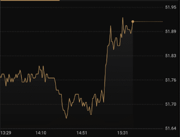

# MPAndroidChart-Chinese-Guide
MPAndroidChart的中文文档和一些经验总结

**MPAndroidChart**是Android平台Start最多而且功能最全的图表库，它有着丰富的功能和低耦合的代码结构，给我们的开发带来了很多便利。

一年前我开始做外汇和期货交易类的软件，由于交易图表的需求我开始使用了MPChart，期间也遇到了很多问题和总结了一些解决方案，计划在这个项目中总结出来给大家。

这个项目计划分为两部分——官方文档翻译和经验总结，MPChart的官方文档解释的很详细，但是缺少图片的说明，给许多使用者带来了困惑，我计划在此基础上补充一些图表说明。二是一些个人的经验总结，方便图表使用者来实现特定的功能，少走一些弯路。

# Demo

# 使用技巧

1.设置LineChart的最后一个点为圆点

2.设置图表的内边距

3.去掉图表自带的margin

4.固定x轴y轴的数量和位置

5.给图表设置“分页”

6.解决组合图表中BarChart、CandleStickChart的第一个点和最后一个点的显示不完整

# 文档翻译

[0.名词解释](./docs/0.名词解释.md)

[1.入门指南](./docs/1.入门指南.md)

[2.与图表交互](./docs/2.与图表交互.md)

[3.设置高亮](docs/3.设置高亮.md)

4.坐标系 (AxisBase)

5.x轴(XAxis)

6.y轴(YAxis)

7.设置数据

8.设置色彩

9.数据格式化(ValueFormatter)

10.坐标轴格式化(AxisValueFormatter)

11.通用设置和样式

12.特定设置和样式

13.图例

14.动态实时数据

15.修改图像配置(Viewport)

16.动画

17.弹出View(MarkerView)

18.ChartData类

19.ChartData的子类

20.DataSet类

21.DataSet的子类

22.ViewPortHandler

23.自定义填充位置(FillFormatter)

24.混淆

25.Realm.io 移动端数据库

26.创建你自己的DataSets

27.杂项(更多你可能用到的功能)

可以通过邮箱[gzw19931217@qq.com](mailto:gzw19931217@qq.com)联系我