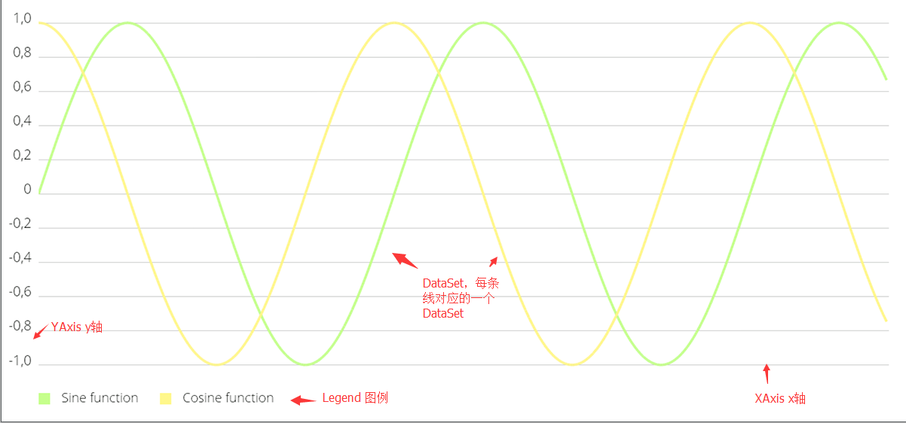
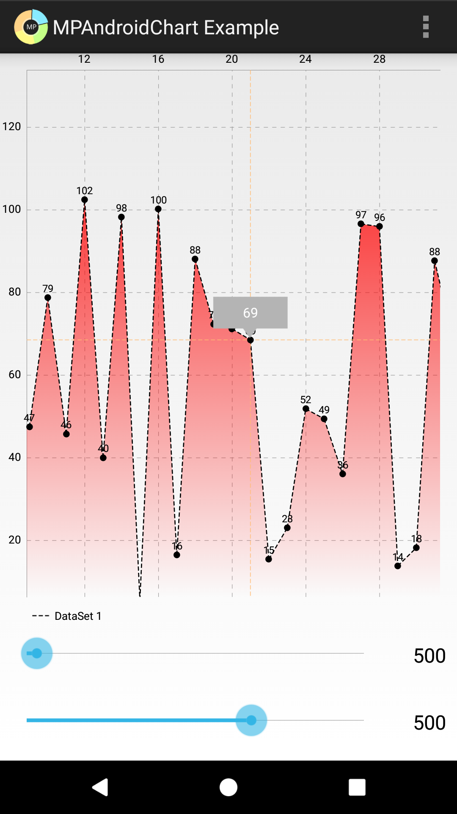

# 名词解释

本节是我个人总结的有关图表的一些解释，不在官方文档中。

上图标注了常用的类和图表的对应关系

上图中显示“69”的地方叫**MarkerView**，值得注意的是它后面有一条黄色的十字线，称作Highlight。MarkerView会随着Highlight的触发而显示。

Highlight可以通过点击触发，也可以通过相应的代码来触发，同时也支持触发多个Highlight。具体可以参考[设置高亮](设置高亮.md)这一节。

